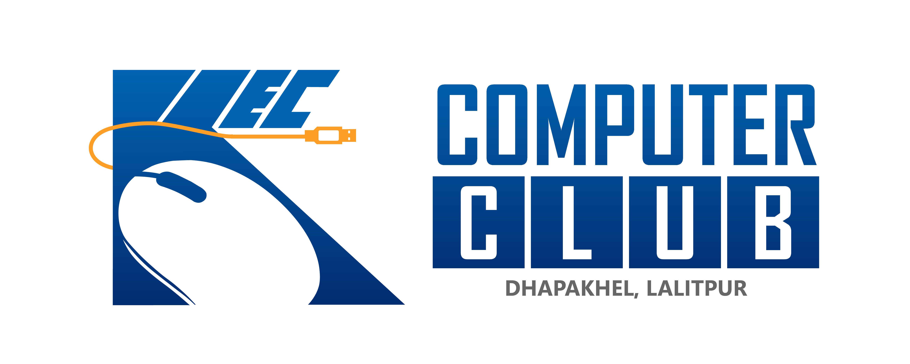

<div align="center">
<a href="https://kec.edu.np/">
    
</a>

# KEC Computer Club Website

[](https://computerclubkec.github.io)
[](https://github.com/computerclubkec/computerclubkec.github.io/graphs/contributors)
[](https://discord.gg/neMkXj7GC3)
[](https://opensource.org/licenses/MIT)
</div>

<div align="center">
    <a href="https://computerclubkec.github.io/">Home</a> |
    <a href="https://computerclubkec.github.io/about/">About Us</a> |
    <a href="https://computerclubkec.github.io/blog/">Blog</a> |
    <a href="https://computerclubkec.github.io/projects/">Projects</a> |
    <a href="https://linktr.ee/computerclubkec">Linktree</a>
</div>

<div align="center">
<strong>The official website repository for the KEC Computer Club.</strong><br>
Our website provides updates on club events, resources, projects, and technical content for students of Kantipur Engineering College and beyond.
</div>

## 📋 Table of Contents
- [About](#about-kec-computer-club)
- [Features](#features)
- [Project Structure](#project-structure)
- [Getting Started](#getting-started)
- [Development](#development)
- [Contributing](#contributing)
- [Community](#community)
- [Development Sessions](#development-sessions)
- [Contact](#contact)

## About KEC Computer Club

Founded in 2013 at **Kantipur Engineering College (KEC)**, the Computer Club is a student-driven organization that promotes tech learning, collaboration, and project development. Our mission is to foster a vibrant tech community where students can learn, innovate, and grow together.

## Features

- 🎯 Event updates and registration
- 📚 Technical resources and tutorials
- 💻 Project showcase
- 📝 Technical blog
- 📱 Responsive design
- 🌐 Cross-browser compatibility

## Project Structure

```
computerclubkec.github.io/
├── _config.yml              # Jekyll configuration
├── _layouts/                # Page layouts
│   ├── default.html
│   ├── post.html
│   └── project.html
├── _includes/              # Reusable components
│   ├── header.html
│   ├── footer.html
│   └── navigation.html
├── _posts/                 # Blog posts
├── _projects/             # Project documentation
├── assets/                # Static resources
│   ├── js/               # JavaScript files
│   └── images/           # Media files
├── pages/                # Static pages
└── docker-compose.yml    # Docker configuration
```

## Getting Started

### Prerequisites

- [Docker](https://www.docker.com/) (recommended): For containerizing and deploying applications, making development and deployment more consistent and portable.
- [Jekyll](https://jekyllrb.com/): Static site generator that converts markdown and other formats into static HTML websites, simplifying web development.
- [Git](https://git-scm.com/):  Distributed version control system for tracking changes in source code during development.
- [Tailwind CSS](https://tailwindcss.com/): Utility-first CSS framework that allows rapid custom design by composing utility classes directly in HTML.

### Design Prototype

The website is being developed based on [this Figma design](https://www.figma.com/design/dWPncZwMB3Im5qntztKgpe/Computer-Club-Website?node-id=0-1&t=snFpqhd7gHsoBQL7-1).

## Development

### Using Docker (Recommended)

```bash
# Clone the repository
git clone https://github.com/computerclubkec/computerclubkec.github.io.git

# Navigate to project directory
cd computerclubkec.github.io

# Start the development server
docker-compose up

# Access the site at http://localhost:4000
```

### Without Docker

```bash
# Install dependencies
bundle install
npm install

# Start the development server
bundle exec jekyll serve

# In a separate terminal, watch for Tailwind CSS changes
npm run watch:css
```

## Contributing

We welcome contributions from everyone! Please follow these steps:

1. Fork the repository
2. Create your feature branch (`git checkout -b feature/AmazingFeature`)
3. Commit your changes (`git commit -m 'Add some AmazingFeature'`)
4. Push to the branch (`git push origin feature/AmazingFeature`)
5. Open a Pull Request

For detailed guidelines, please read our [CONTRIBUTING.md](CONTRIBUTING.md) and [NAMING-CONVENTION.md](NAMING-CONVENTION.md) files.

## Community

### Development Sessions

We host regular development sessions to:
- Review pull requests
- Discuss new features
- Debug issues
- Share knowledge
- Plan future improvements

Join our [Discord Server](https://discord.gg/neMkXj7GC3) to participate in these sessions!

### Contributors

Thanks to our dedicated contributors who continue to build and improve the KEC Computer Club's online presence:

<a href="https://github.com/computerclubkec/computerclubkec.github.io/graphs/contributors">
  
</a>

### Code of Conduct

Please read our [Code of Conduct](CODE_OF_CONDUCT.md) to understand our community standards and expectations.

## Contact

- **Email:** [computerclub@kec.edu.np](mailto:computerclub@kec.edu.np)
- **Discord:** [Join our server](https://discord.gg/YOUR_INVITE_LINK)
- **Location:** Dhapakhel, Lalitpur, Nepal
- **Linktree:** [linktr.ee/computerclubkec](https://linktr.ee/computerclubkec)
- **Website:** [computerclubkec.github.io](https://computerclubkec.github.io)

## License

This project is licensed under the MIT License - see the [LICENSE](LICENSE) file for details.

---

<div align="center">
Made with ❤️ by KEC Computer Club
</div>